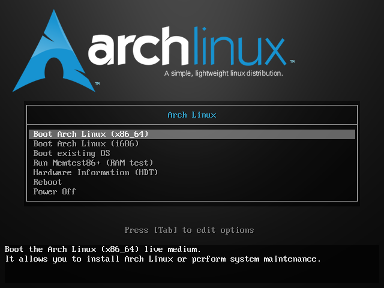
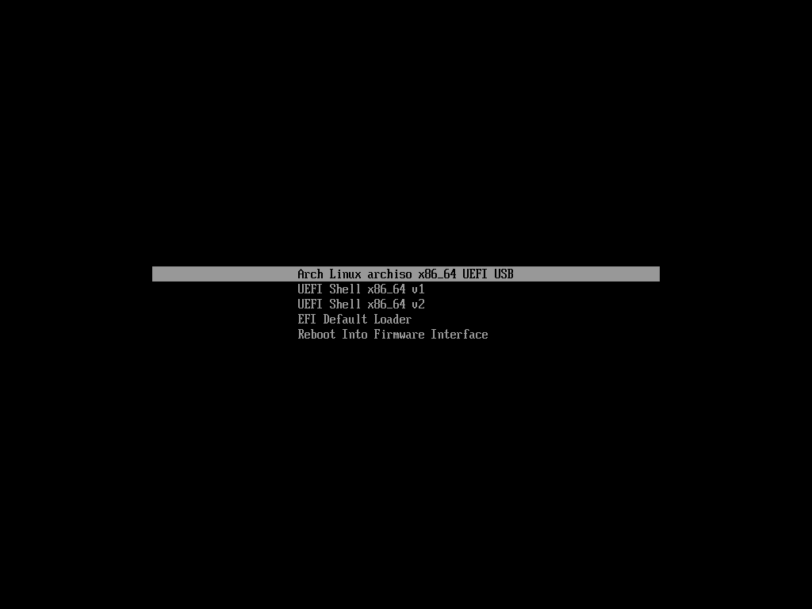
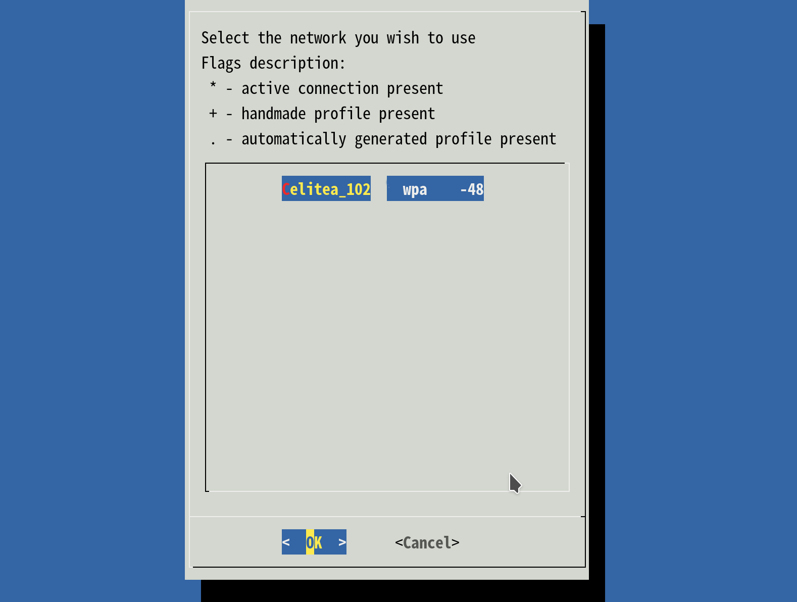
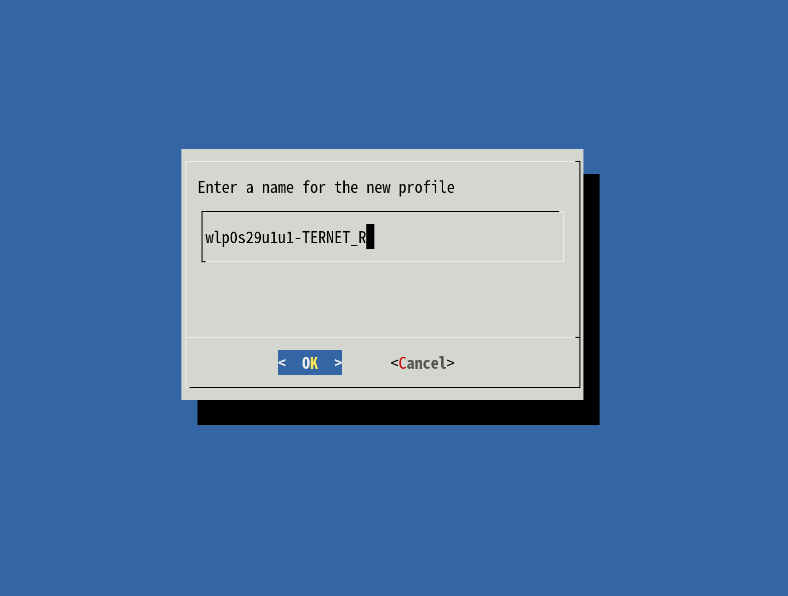

# 安装 Arch Linux

重启电脑，然后让电脑从 U 盘启动。

```text
具体怎么搞还是要看电脑的硬件啦 😂

大多数的电脑都有一个在开机时按下一个按键来选择从哪里启动的选项（例如 Dell 和 ThinkPad 是 F12）。
UEFI 的话， 刚才提到的那个“使用设备” 的选项也可以。

还是去翻一翻汝自己的电脑生产商的说明书更快一点 ……
```

* MBR 成功启动以后像这样



选第一项。😂 （除了 CPU 不支持的都应该用x86\_64 😋）

```text
后来 Arch Linux 不再支持 i686 啦，所以这里应该只会看见 x86_64 那一项（但是咱懒得换图片啦……）
```

* UEFI 成功启动以后像这样

 :alt: UEFI

还是选第一项。😂

然后等待一会以后会出现……

```bash
root@archiso ~ #
```

这就表示已经启动完毕啦 ~\(&gt;\_&lt;~\)

> root是用戶名，前面那個數字是上一個命令的exit status啦，如果正常結束的命令exit status是0，就不會顯示出來，你有 1 2 127 這種都是某種東西報錯了.
>
> -- 现任 Arch Linux TU 之一的 farseerfc 在 [https://www.zhihu.com/question/45329752/answer/98733823](https://www.zhihu.com/question/45329752/answer/98733823) 中写到……

## 联网

```text
因为 ArchISO 就是个重启就没了的 Live 环境，安装时需要的软件包都要另外下载。
```

首先当然是联网啦，如果是自动获取 IP 地址的有线网络，那么应该啥也不用做，ping 一下试试？

```bash
root@archiso ~ # ping archlinux.org
# 汝应该会看到像这样的东西 ……
PING archlinux.org (138.201.81.199) 56(84) bytes of data.
64 bytes from apollo.archlinux.org (138.201.81.199): icmp_seq=1 ttl=49 time=361 ms
……
```

（把电脑用网线接到家里的路由器上就有相同的效果）

如果没网的话…… 😂

* 先用 `ip link` 确定一下网卡

```bash
root@archiso ~ # ip link
1: lo: <LOOPBACK,UP,LOWER_UP> mtu 65536 qdisc noqueue state UNKNOWN mode DEFAULT group default qlen 1
    link/loopback 00:00:00:00:00:00 brd 00:00:00:00:00:00
2: enp4s0: <NO-CARRIER,BROADCAST,MULTICAST,UP> mtu 1500 qdisc fq_codel state DOWN mode DEFAULT group default qlen 1000
    link/ether c8:9c:dc:a8:ab:c3 brd ff:ff:ff:ff:ff:ff
3: wlp0s29u1u1: <BROADCAST,MULTICAST,UP,LOWER_UP> mtu 1500 qdisc mq state UP mode DORMANT group default qlen 1000
    link/ether 44:94:fc:0f:63:b9 brd ff:ff:ff:ff:ff:ff
```

这个例子里，lo 是本地环回不用管它，enp 开头的是有线网卡，wlp 开头的是无线网卡。

如果汝明明有无线网卡却没识别的话，有可能汝是某无线网卡厂商受害者😂😂

这时可以：

* 有 Android 手机的话，手机连 WiFi ，然后用“USB 网络共享”共享给电脑。
* 找个 USB 无线网卡插上 😂
* 连有线😂😂
* 如果有无线网卡的话，试试连接到 WiFi ……
  * 输入 `wifi-menu` ,等一下会看到找到的 WiFi 网络的列表



* 选择一个网络，保存网络配置文件



* 如果有密码的话，输入密码


* 然后按 Enter 确认，连到 WiFi 的话会返回 Shell。

如果汝的 WiFi 是用 WPA2-Enterpise 验证的（输入用户名和密码那种）……wifi-menu 现在还不支持这个，那么汝大概需要自己准备wpa\_applicant的配置文件。

* 大概是这个样子的（如果汝使用的是WPA-EAP，并且二阶段认证是MSCHAPv2的话）

  ```text
     network={
         ssid="汝WiFi的名字"
         key_mgmt=WPA-EAP
         eap=PEAP
         identity="汝的用户名"
         password="汝的密码"
         phase2="auth=MSCHAPV2" 
     }
  ```

* 注意保留引号，然后上面那个V要大写。
* 然后汝把这个东西保存成比如说`wpa.conf`，然后就可以输入`sudo wpa_supplicant -i 汝的网卡 -c wap.conf` 打开WiFi了
* 至于汝的网卡叫什么……就是上面说的运行`ip link`列出的那个叫做`wlp`的东西。

谁叫 Arch 连不上网的话都装不了 😂

另外，如果汝连接的网络需要网页登录（Captive Portal）,可以用 `elinks` 碰碰运气 😂

```bash
    # 用汝的门户的 URL 替换 <your_captive_portal_url>
    # 如果不知道的话，随便访问一个 HTTP 网站试试，应该就会被重定向到 Portal 了
    root@archiso ~ # elinks http://<your_captive_portal_url>
```

几个可供使用的 Captive Portal：

* [http://captive.v2ex.co/](http://captive.v2ex.co/)
* [http://detectportal.firefox.com/](http://detectportal.firefox.com/)
* [http://captive.apple.com/](http://captive.apple.com/)

## 时间同步

用 `timedatectl set-ntp true` 保证时间同步 。

```bash
root@archiso ~ # timedatectl set-ntp true
root@archiso ~ # timedatectl status
    Local time: Fri 2016-10-28 17:39:42 UTC
    Universal time: Fri 2016-10-28 17:39:42 UTC
    RTC time: Fri 2016-10-28 17:39:42
    Time zone: UTC (UTC, +0000)
Network time on: yes
NTP synchronized: no
RTC in local TZ: no
```

因为有不少操作需要准确的时间呐，例如 HTTPS 和 GnuPG 都需要准确的时间来验证证书的有效性。

但是如果因为各种原因没法同步的话，那就只好手动设置咯~

```bash
# timectl set-time "yyyy-MM-dd hh:mm:ss"
root@archiso ~ # timectl set-time "2016-10-28 17:39:42"
```

## 准备硬盘空间

这里用 cgdisk \(UEFI\)/ cfdisk \(MBR\) 来给硬盘分区。

首先输入 `lsblk` 看看汝的硬盘是哪个设备：

```bash
root@archiso ~ # lsblk
NAME   MAJ:MIN RM   SIZE RO TYPE MOUNTPOINT
sda      8:0    0 463.9G  0 disk
├─sda1   8:1    0   512M  0 part
├─sda2   8:2    0    16M  0 part
├─sda3   8:3    0 103.4G  0 part
└─sda4   8:4    0 253.4G  0 part
sdb      8:16   1   7.5G  0 disk
└─sdb1   8:17   1   7.5G  0 part /run/archiso/bootmnt
sr0     11:0    1  1024M  0 rom
loop0    7:0    0 346.1M  1 loop /run/archiso/sfs/airootfs
```

如果那是一块新硬盘或者已经清空的硬盘的话，汝大概看不到 /dev/sda1 一类的分区。

如果汝没看到 /dev/sda 却看到了一些其它的东西的话：

* /dev/nvme0n1 一类的：表示汝的电脑上有一块 NVMe SSD （发出了羡慕的目光（咳咳））
* /dev/mmcblk0 一类的：表示汝的电脑上有 eMMC 存储（例如是早期的 Windows 8 平板电脑啥的）

  这种时候的话可能汝 ArchISO 的 U 盘就跑到 sda 去了，在下面的操作时记得注意一下。

比如咱这里 sda 是咱的硬盘，于是运行 cgdisk 时加上 /dev/sda 这个参数：

```text
/dev 是一个虚拟目录（也就是并不在硬盘上），它会把电脑上的设备映射成一个个文件  _(:з」∠)_
```

再学究的解释真不会了……

### cgdisk

```bash
root@archiso ~ # cgdisk /dev/sda
```

如果汝在用 cgdisk 的话汝可能会看到这样的提示：

```bash
    Warning! Non-GPT or damaged disk detected! This program will attempt to
    convert to GPT form or repair damage to GPT data structures, but may not
    succeed. Use gdisk or another disk repair tool if you have a damaged GPT
    disk.

    Press any key to continue....
```

这表示 cdgisk 在这块硬盘上找不到 GPT 分区表。如果这是一块新硬盘或者已经清空的硬盘的话 不必担心，继续即可。否则请立即停下来检查一下硬盘（或者汝有这块硬盘的备份的话也可以继续）。

```bash
                                            cgdisk 1.0.1

                                        Disk Drive: /dev/sda
                                    Size: 972906545, 463.9 GiB

Part. #     Size        Partition Type            Partition Name
----------------------------------------------------------------
            1007.0 KiB  free space
1           512.0 MiB   EFI System                EFI system partition
2           16.0 MiB    Microsoft reserved        Microsoft reserved partition
3           103.4 GiB   Microsoft basic data      Basic data partition
4           253.4 GiB   Microsoft basic data      Basic data partition
            106.6 GiB   free space


    [ Align  ]  [ Backup ]  [  Help  ]  [  Load  ]  [  New   ]  [  Quit  ]  [ Verify ]  [ Write  ]
```

cgdisk 的界面大概像这样啦，用上下方向键把光标移动到汝之前的空闲空间上去（例如咱这里是最后一个）

新硬盘的话应该只有一个 free space 😂

用左右方向键把下面一排按钮上的光标移动到 New 上，然后按 Enter。

（这里看不出光标😂，黑色背景下光标应该是白的吧😂😂）

接下来会问几个问题（\# 开头的是咱加上的注释😂）：

```bash
# 数字可能和汝看到的不一样😂
# 起始扇区的位置，直接 Enter 就行
First sector (749424640-972906511, default = 749424640):
# 大小，可以是扇区数，也可以是实际的大小（例如 100M，20G一类的），要用掉整个剩余空闲空间的话，直接 Enter 就行。
Size in sectors or {KMGTP} (default = 223481872):
# 分区类型，默认的就好
# 但是如果要建立新的 EFI 系统分区的话 ，分区类型是 `ef00`
# 但是如果要建立新的 交换空间（就是虚拟内存啦）的话 ，分区类型是 `8200`
Current type is 8300 (Linux filesystem)
Hex code or GUID (L to show codes, Enter = 8300):
# 设置卷标，不设置也行。
Current partition name is ''
Enter new partition name, or <Enter> to use the current name:
```

然后汝应该会发现下面的空闲空间变成 Linux filesystem 了呗~

要保存分区表的话，用左右方向键把下面一排按钮上的光标移动到 Write 上，然后按 Enter。

```bash
    Are you sure you want to write the partition table to disk? (yes or no):

            Warning!! This may destroy data on your disk!
```

在这里输入 `yes` （就是 yes，不是 y Y YES 啥的😂），然后按 Enter。

然后下面会闪过一行 "The operation has completed successfully" ,这时就可以退出了。

用左右方向键把下面一排按钮上的光标移动到 Quit 上，然后按 Enter。

### cfdisk

如果汝在用 cfdisk 的话汝可能会看到这样的提示：

```bash
                                ┌ Select label type ───┐
                                │ gpt                  │
                                │ dos                  │
                                │ sgi                  │
                                │ sun                  │


                Device does not contain a recognized partition table.
        Select a type to create a new label or press 'L' to load script file.
```

这表示 cfgisk 在这块硬盘上找不到可以识别的分区表。如果这是一块新硬盘或者已经清空的硬盘的话 不必担心，选择 dos 继续即可。否则请立即停下来检查一下硬盘（或者汝有这块硬盘的备份的话也可以继续）。

这就是 cfdisk 的主界面啦：

```bash
                                                Disk: /dev/sdc
                            Size: 465.8 GiB, 500107862016 bytes, 976773168 sectors
                                    Label: dos, identifier: 0x178bfb32

Device            Boot               Start              End          Sectors         Size       Id Type
>>  Free space                            2048        976773167        976771120       465.8G                           


┌──────────────────────────────────────────────────────────┐
│Filesystem UUID: 3AB8802AB87FE2B5                                                                                   │
│     Filesystem: ntfs                                                                                               │
└──────────────────────────────────────────────────────────┘
                        [   New  ]  [  Quit  ]  [  Help  ]  [  Write ]  [  Dump  ]


                                    Create new partition from free space
```

也是选择 new 然后输入大小：

```bash
Partition size:
# 然后可能会让汝选择是主分区还是扩展分区，按需选择就 OK 
[primary]  [extended]
```

但是如果汝需要调整分区类型的话，选中要改变的分区然后把光标移动到 Type 上按 Enter，选择一个分区类型：

```bash
                                                Disk: /dev/sdc
                            Size: 465.8 GiB, 500107862016 bytes, 976773168 sectors
                                    Label: dos, identifier: 0xe0a3ecf7

Device           Boot               Start             End        Sectors        Size      Id Type
>>  /dev/sdc1                            2048         1050623        1048576        512M      ef EFI (FAT-12/16/32)     
/dev/sdc2                         1050624       976773167      975722544      465.3G      83 Linux


┌──────────────────────────────────────────────────────────┐
│Partition type: EFI (FAT-12/16/32) (ef)                                                                             │
└──────────────────────────────────────────────────────────┘
        [Bootable]  [ Delete ]  [ Resize ]  [  Quit  ]  [  Type  ]  [  Help  ]  [  Write ]  [  Dump  ]
```

要保存分区表的话，用左右方向键把下面一排按钮上的光标移动到 Write 上，然后按 Enter。

```bash
    Are you sure you want to write the partition table to disk? (yes or no):
```

在这里输入 `yes` （就是 yes，不是 y Y YES 啥的😂），然后按 Enter。

然后下面会闪过一行 "The operation has completed successfully" ,这时就可以退出了。

用左右方向键把下面一排按钮上的光标移动到 Quit 上，然后按 Enter。

然而汝以为这样就结束了？还没格式化呢 \(╯°Д°）╯︵/\(.□ . \)

## 创建文件系统+挂载

### 所以挂载是啥玩意？

GNU/Linux 不是用 Windows 那样的盘符来分区的啦，GNU/Linux 继承了 Unix 的整个目录结构 从根目录 / 开始。然后下面是各种子目录。

大多数的 GNU/Linux 发行版都遵循一个叫做“文件系统层次结构标准”（Filesystem Hierarchy Standard， 有时也简称作 FHS）的标准，汝可以 `ls /` 一下看看会不会发现一些例如 /bin /home /usr 一类的目录？ 这就是拜这个标准所赐 😂

在 Windows 里，汝大概会把不同的文件放在不同的盘符下的硬盘分区里。 在 GNU/Linux 中，咱们通常就是把不同的分区 挂载到整个目录结构中的一处。向挂载好的目录写入的文件就会保存在被挂载的磁盘分区上。

首先还是用 `lsblk` 确定一下分区的名称，为了以防万一记得加上 -f 参数：

```bash
root@archiso ~ # lsblk -f
NAME   FSTYPE   LABEL       UUID                                 MOUNTPOINT
sda
├─sda1 vfat               3C44-B4ED
├─sda2
├─sda3 ntfs               42E243C5E243BBC3
├─sda4 ntfs   新加卷      58741F29741F0A00
└─sda5
sdb
└─sdb1 vfat   ARCH_201610 EAC8-F012                            /run/archiso/bootmnt
sr0
loop0  squashfs                                                  /run/archiso/sfs/airootfs
```

第一排分别表示设备名称，文件系统类型，卷标，UUID和挂载点。

咱这里的话 sda1 那个 vfat 分区就是 EFI 系统分区啦，sda5 就是刚刚新建的分区啦~（因为还没格式化所以没有文件系统😂）

用 `mkfs.ext4` 把那个分区格式化成 ext4 文件系统咯~

```text
mkfs 可以格式化成某一个汝指定的文件系统（就像刚才那样 mkfs.ext4 可以格式化出一个 ext4 文件系统）

ext 家族大概是 GNU/Linux 最古老，应用的最广泛的文件系统了吧……

当然可以用的文件系统有很多啦，如果汝想再了解一些的话，可以去 ArchWiki 看一看：

https://wiki.archlinux.org/index.php/File_systems

记得自己看清楚是哪个分区别格式化错了 😂
```

```bash
root@archiso ~ # mkfs.ext4 /dev/sda5
mke2fs 1.43.3 (04-Sep-2016)
Creating filesystem with 27935234 4k blocks and 6987776 inodes
Filesystem UUID: a3943e57-6217-4a5f-8e57-ade5771315c0
Superblock backups stored on blocks:
    32768, 98304, 163840, 229376, 294912, 819200, 884736, 1605632, 2654208,
    4096000, 7962624, 11239424, 20480000, 23887872

Allocating group tables: done
Writing inode tables: done
Creating journal (131072 blocks): done
Writing superblocks and filesystem accounting information: done

root@archiso ~ #
```

等一排文字闪过就格式化完了……

如果要格式化新的 EFI 系统分区的话，用 `mkfs.vfat`

如果要格式化新的 交换空间的话，用 `mkswap`

接下来用 mount 挂载分区啦~ （。＞ω＜）。

```bash
# mount <设备名称> <目标文件夹>
# /mnt 挺合适的
root@archiso ~ # mount /dev/sda5 /mnt
# 如果要挂载 EFI 系统分区的话，建议挂载到 /mnt/boot
# 所以先建立相应的文件夹
root@archiso ~ # mkdir /mnt/boot
root@archiso ~ # mount /dev/sda1 /mnt/boot
# 有交换空间的话不用挂载，用 swapon 命令。
root@archiso ~ # swapon /dev/sda6
```

### 选择软件仓库镜像

```text
软件仓库（在Debian系发行版中，又叫做“软件源”）是软件包存储的地方。通常我们所说的软件仓库指在线软件仓库，亦即用户从互联网获取软件的地方。
```

用 nano 打开 `/etc/pacman.d/mirrorlist`

```bash
root@archiso ~ # nano /etc/pacman.d/mirrorlist


GNU nano 2.7.0                        File: /etc/pacman.d/mirrorlist

##
## Arch Linux repository mirrorlist
## Sorted by mirror score from mirror status page
## Generated on 2016-10-01
##

## Score: 0.2, France
Server = http://archlinux.polymorf.fr/$repo/os/$arch
## Score: 0.3, France
Server = http://arch.tamcore.eu/$repo/os/$arch
## Score: 0.3, Germany
Server = http://mirrors.cicku.me/archlinux/$repo/os/$arch
## Score: 0.3, Czech Republic
Server = http://ftp.sh.cvut.cz/arch/$repo/os/$arch
## Score: 0.3, Germany
Server = http://mirror.js-webcoding.de/pub/archlinux/$repo/os/$arch
## Score: 0.4, Netherlands
Server = http://ftp.nluug.nl/os/Linux/distr/archlinux/$repo/os/$arch
## Score: 0.4, Poland
                                        [ Read 517 lines ]
^G Get Help    ^O Write Out   ^W Where Is    ^K Cut Text    ^J Justify     ^C Cur Pos     ^Y Prev Page
^X Exit        ^R Read File   ^\ Replace     ^U Uncut Text  ^T To Spell    ^_ Go To Line  ^V Next Page
```

这是 GNU nano 的主界面，最简单的方法还是把下面那些 Mirrors 先全删掉然后输入一个新的， 用光标指向某一行以后同时按下 Ctrl+K 就好。然后自己输入一个 Mirror ，下面给出几个中国国内的 Mirror：

（所谓的 Ctrl+K 就是这两个键一起按😂）

```bash
# 网易
Server = http://mirrors.163.com/archlinux/$repo/os/$arch
# 清华大学 TUNA 协会
Server = https://mirrors.tuna.tsinghua.edu.cn/archlinux/$repo/os/$arch
# 中国科学技术大学
Server = https://mirrors.ustc.edu.cn/archlinux/$repo/os/$arch
# 西安交通大学
Server = https://mirrors.xjtu.edu.cn/archlinux/$repo/os/$arch
```

输入完以后按下 Ctrl+O 写入，按 Enter 确定，再按 Ctrl+X 退出。

然后用 `pacman -Syy` 刷新一下软件包数据库。

```bash
root@archiso ~ # pacman -Syy
:: Synchronizing package databases...
core                                  120.9 KiB  4.92M/s 00:00 [##################################] 100%
extra                                1755.6 KiB  5.24M/s 00:00 [##################################] 100%
community                               3.7 MiB  6.82M/s 00:01 [##################################] 100%
root@archiso ~ #
```

## 安装基本系统

用 pacstrap 安装基本系统，默认会安装 base 组（就是最基本的软件包咯）， 要通过 AUR 或者 ABS 编译安装软件包,还需要安装 base-devel 啦：

```text
评论里 farseerfc 提到装几个连接无线网络需要的软件包。(iw dialog wpa_supplicant wpa_actiond)
```

```bash
root@archiso ~ # pacstrap /mnt base base-devel iw dialog wpa_supplicant wpa_actiond
```

这个组并没有包含全部 live 环境中的程序，有些需要额外安装， [packages.both](https://projects.archlinux.org/archiso.git/tree/configs/releng/packages.both) 页面包含了它们的差异呗~

其他软件以后会用 pacman 再安装啦~

安装完以后大概会是这个样子 \(\´・ω・\｀\)

```bash
pacstrap /mnt base base-devel   29.09s user 2.61s system 85% cpu 37.271 total
```

## 准备进入 chroot 环境

生成 fstab 啦 ~

```text
所以 fstab 又是个啥玩意？

fstab(5)文件可用于定义磁盘分区，各种其他块设备或远程文件系统应如何装入文件系统。

每个文件系统在一个单独的行中描述。这些定义将在引导时动态地转换为系统挂载单元，并在系统管理器的配置重新加载时转换。
在启动需要挂载的服务之前，默认设置会自动fsck和挂载文件系统。例如，systemd会自动确保远程文件系统挂载
（如NFS或Samba）仅在网络设置完成后启动。因此，在/etc/fstab中指定的本地和远程文件系统挂载应该是开箱即用的。

emmmmm
```

```bash
# genfstab
usage: genfstab [options] root

Options:
    -L             Use labels for source identifiers (shortcut for -t LABEL)
    -p             Exclude pseudofs mounts (default behavior)
    -P             Include printing mounts
    -t TAG         Use TAG for source identifiers
    -U             Use UUIDs for source identifiers (shortcut for -t UUID)

    -h             Print this help message

genfstab generates output suitable for addition to an fstab file based on the
devices mounted under the mountpoint specified by the given root.

root@archiso ~ # genfstab -U /mnt >> /mnt/etc/fstab
```

然后用 arch-chroot 向新系统出发~

```text
因为还有些配置没完成嘛……
```

```bash
root@archiso ~ # arch-chroot -help
usage: arch-chroot chroot-dir [command]

    -h                  Print this help message
    -u <user>[:group]   Specify non-root user and optional group to use

If 'command' is unspecified, arch-chroot will launch /bin/bash.

root@archiso ~ # arch-chroot /mnt /bin/bash
[root@archiso /] #
```

### 设置基本系统

```text
这一节以 # 开头只表示以 root 用户运行，汝不用把 # 输入到终端里啦~
```

* 设置时区（中国的时区是 Asia/Shanghai）

  ```text
    # ln -s <源文件> <目标> 创建一个符号链接
    # ln -s /usr/share/zoneinfo/Asia/Shanghai /etc/localtime
  ```

* 设置时间标准 为 UTC，并调整 时间漂移:

  ```text
    # hwclock --systohc --utc
  ```

如果汝正在尝试安装双系统，在进入 Windows 以后可能会发现 Windows 的时间不对了 ，因为 Windows 默认的硬件时钟是 localtime（

可以用一条注册表键值让 Windows 使用 UTC 作为硬件时钟（在早于 Windows 7 的系统上发现过这样做会出现一些严重的问题： [http://www.cl.cam.ac.uk/~mgk25/mswish/ut-rtc.html](http://www.cl.cam.ac.uk/~mgk25/mswish/ut-rtc.html) ）

```text
reg add "HKEY_LOCAL_MACHINE\System\CurrentControlSet\Control\TimeZoneInformation" /v RealTimeIsUniversal /d 1 /t REG_DWORD /f
```

* /etc/locale.gen 是一个仅包含注释文档的文本文件。指定您需要的本地化类型，去掉对应行前面的注释符号（＃）就可以啦，还是用 nano 打开，建议选择帶UTF-8的項：

```bash
    # nano /etc/locale.gen

    en_US.UTF-8 UTF-8
    zh_CN.UTF-8 UTF-8
    zh_TW.UTF-8 UTF-8
```

* 执行 locale-gen 以生成 locale 讯息：

```bash
    # locale-gen
```

* 创建 locale.conf 并提交您的本地化选项：

  将系统 locale 设置为en\_US.UTF-8，系统的 Log 就会用英文显示，这样更容易问题的判断和处理。用户可以设置自己的 locale。

  警告: 不推荐在此设置任何中文locale，或导致tty乱码。

```bash
    # echo 用来输出某些文字，后面的大于号表示把输出保存到某个文件里啦~
    # 或者可以用文字编辑器新建这个文件加上这一行。

    # echo LANG=en_US.UTF-8 > /etc/locale.conf
```

* 设置一个喜欢的主机名（用汝的主机名代替 myhostname ）：

```bash
    # echo myhostname > /etc/hostname
```

* 设置 root 的密码（输入密码的时候就是啥也没有 ╮\(￣▽￣\)╭ ）：

```text
    [root@archiso /]# passwd
    New password:
    Retype new password:
    passwd: password updated successfully
```

* 安装启动管理器（例如 GRUB ）：

  pacman 是 Arch Linux 的包管理器，目前汝需要知道的只有 `-S` 命令可以安装软件包 😂

  * UEFI 用户先再安装几个必要的软件包咯~

    ```text
      # pacman -S efibootmgr dosfstools
    ```

  * 然后安装 GRUB

    ```text
     # pacman -S grub os-prober
    ```

  * 把 GRUB 安装到硬盘：

    ```text
     # MBR 用户这么做 （记得用汝自己硬盘的名称代替 sda ，不要带上表示分区的数字啦~）：

     # grub-install --target=i386-pc /dev/sda --recheck

     # UEFI 用户这么做：

     # grub-install --target=x86_64-efi --efi-directory=/boot --bootloader-id=grub --recheck
    ```

EFI 安装成功以后大概像这样 😂

```bash
[root@archiso /]# grub-install --target=x86_64-efi --efi-directory=/boot --bootloader-id=grub --recheck
Installing for x86_64-efi platform.
Installation finished. No error reported.
```

然后生成必要的配置文件：

```bash
[root@archiso /]# grub-mkconfig -o /boot/grub/grub.cfg
Generating grub configuration file ...
Found linux image: /boot/vmlinuz-linux
Found initrd image(s) in /boot: initramfs-linux.img
Found fallback initrd image(s) in /boot: initramfs-linux-fallback.img
WARNING: Failed to connect to lvmetad. Falling back to device scanning.
done
```

### 完工啦~

* 离开 chroot 环境：

  ```text
    # exit
  ```

* 卸载挂载的分区，（其实不是必须的，因为马上就重启啦~）

  ```text
    # umount -R /mnt
  ```

* 重新启动，准备迎接新的系统吧 ~\(&gt;\_&lt;~\)

  虽然好像只是个架子 😂，接下来咱们会进行一些配置把它搞成可以使用的样子？

