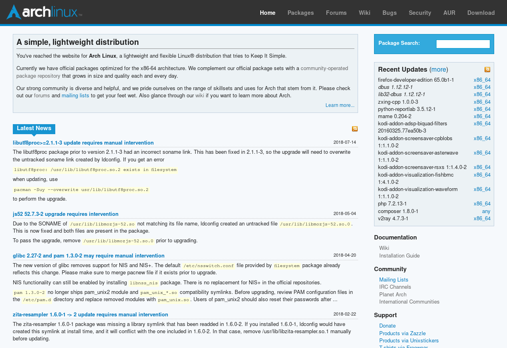
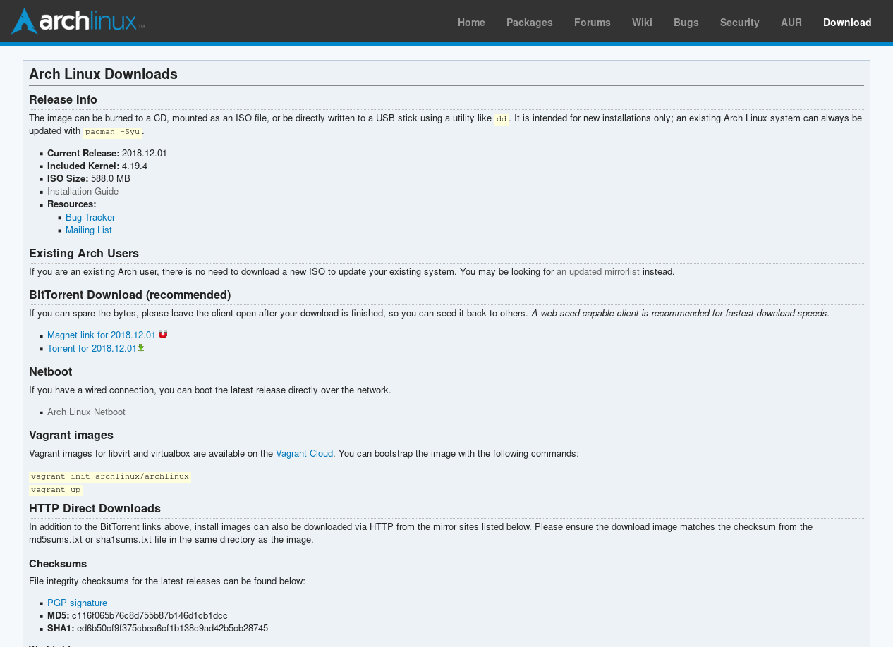
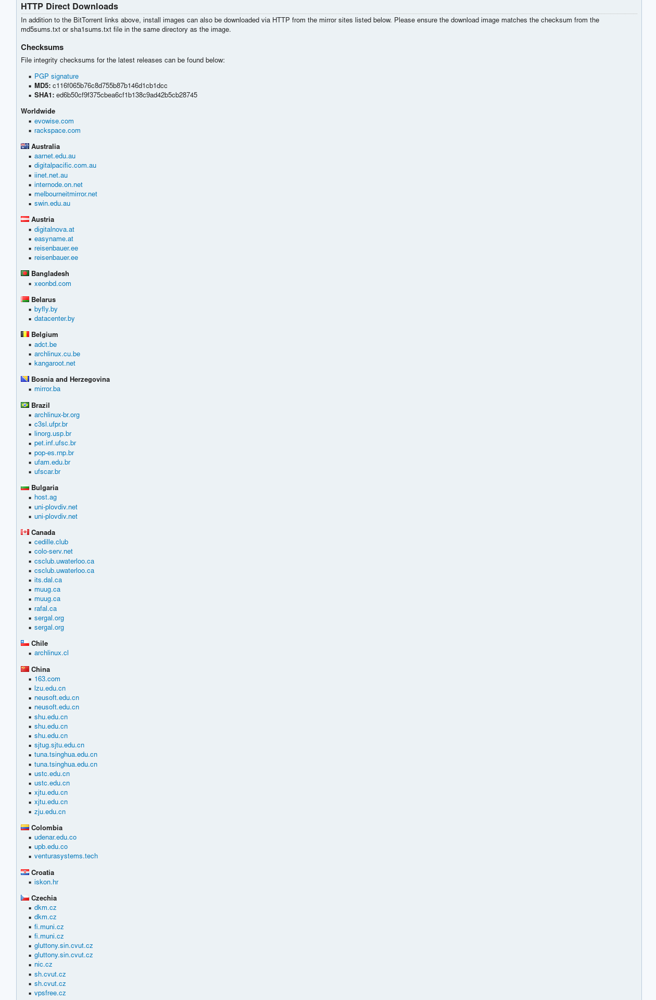
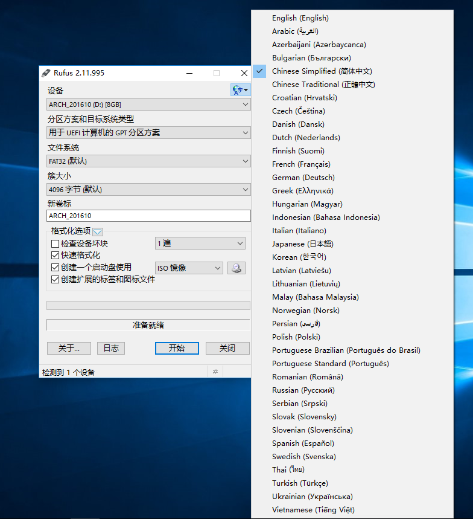
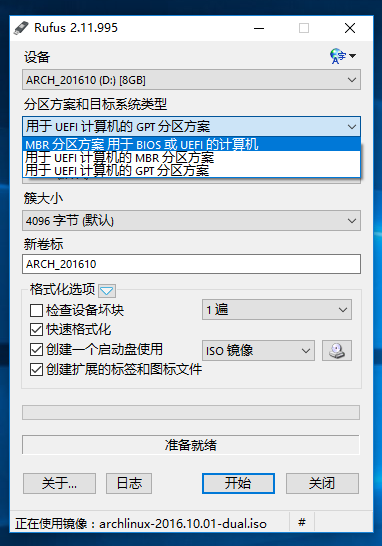
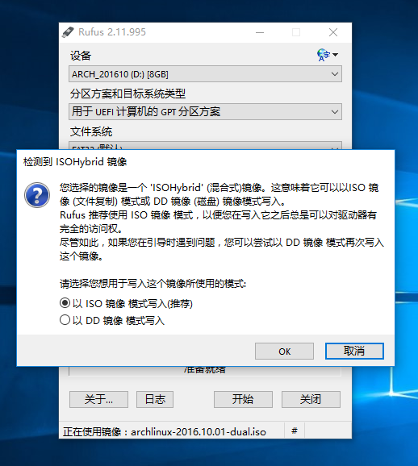
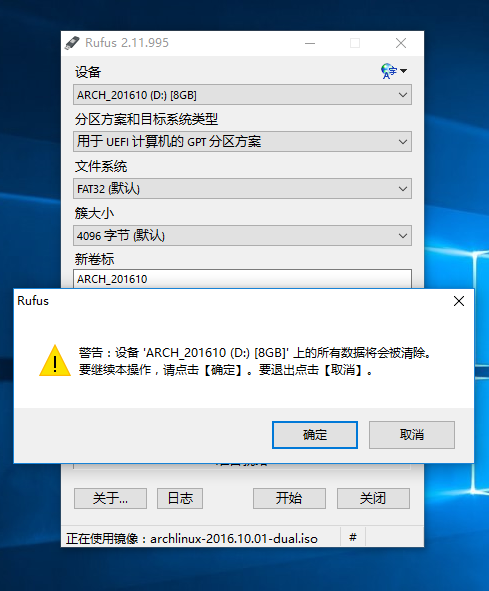

# 下载和制作 Arch Linux 的安装介质

## 何谓安装映像？

> 安装映像是一种磁盘映像，大部分安装映像是 ISO 映像（当然也有像 AOSC 那样放出 tarball （伪安装映像）的异类）。

## 下载 Arch Linux 的安装映像

首先用汝喜欢的浏览器打开 [https://www.archlinux.org](https://www.archlinux.org) 啦，大概像这个样子。



当然是戳右上角的 Download 按钮啦 ~



如果汝会使用 Bitorrent 下载的话，可以从 `BitTorrent Download (recommended)` 一节中下载到种子或磁力链接。

或者往下翻，有 HTTP\(S\) 镜像可用：



找一个距离接近的网站进去看看吧，大概会看到这样的东西：

```text
../
arch/                                              01-Dec-2018 10:16                   -
archlinux-2018.12.01-x86_64.iso                    01-Dec-2018 10:17           616562688
archlinux-2018.12.01-x86_64.iso.sig                01-Dec-2018 10:18                 310
archlinux-2018.12.01-x86_64.iso.torrent            01-Dec-2018 10:18               38812
archlinux-bootstrap-2018.12.01-x86_64.tar.gz       01-Dec-2018 10:18           147904918
archlinux-bootstrap-2018.12.01-x86_64.tar.gz.sig   01-Dec-2018 10:18                 310
md5sums.txt                                        01-Dec-2018 10:18                 145
sha1sums.txt                                       01-Dec-2018 10:18                 161
```

汝需要下载的是 ISO 和它的散列值文件，例如这里的 `archlinux-2018.12.01-x86_64.iso` 和 `sha1sums.txt` 。如果汝了解 openPGP 的使用的话，可以把签名文件也下载下来。（ `archlinux-2018.12.01-x86_64.iso.sig` ）

```text
不过要是知道 openPGP 怎么用的话这个就不是问题了吧 …… 😂
```

## 在 Windows 中检查 ISO 的散列值

```text
这一步是为了检查下载到的 ISO 的完整性，于是如果汝是用 Bitorrent 下载的，
汝的 Bitorrent 客户端会自动帮忙检查下载完的文件的完整性，不用多此一举了 😂
```

从[这个地方](http://implbits.com/products/hashtab/HashTab_v6.0.0.34_Setup.exe)下载 HashTab 并安装。 右键下载下来的镜像，选择“属性”，你会看到一个叫做“File Hashes”的标签，打开就能看到校验码了。然后与打开的校验码文件比对即可（这个文件要从 HTTPS 主站或镜像站拿下来）

```text
尽管 md5 和 sha1 已经被认为是不安全的散列算法了，但是如果仅仅是验证文件的完整性的话是可以的。验证文件的真实性（？）就要靠 openPGP 了。
```

## （可选）在 Windows 中验证文件的 openPGP 签名

```text
#TODO
```

## 使用 Rufus 制作安装 USB

但前提是汝的电脑能从 U 盘启动 😂 （不过最近几年生产的电脑都应该可以了吧……

Windows 下咱比较推荐一个叫 rufus 的软件，[官方网站在这](https://rufus.akeo.ie/)

下载完以后双击运行，需要管理员权限，记得看有没有数字签名。（有数字签名时用户账户控制的对话框是蓝色的）

Rufus 自带多国语言（当然也包括中文啦），如果汝系统语言不是中文的话，点击那个地球图标就可以修改语言了啦~



然后戳有点像光盘的按钮选择刚下载好的 ISO 镜像


然后选择一种启动类型，UEFI 就选最后一个，不是的话就选第一个。



写入方式选推荐的就好 （´＿｀）



确认（要知道汝按下确认以后就没有回头路了，所以记得提前备份 U 盘上的资料 😂）



然后坐等完成，完成以后汝的 U 盘卷标应该是 "ARCH\_201610" 这样的 （后面四位年份和两位月份），不要改成别的，万一不对记得照 ISO 改回来 😂😂

