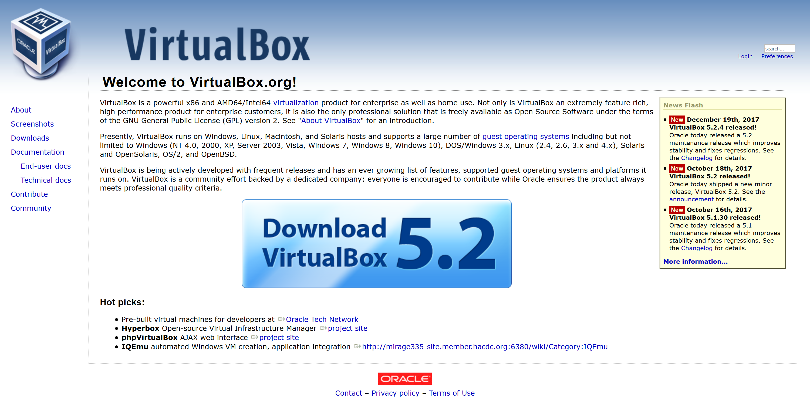
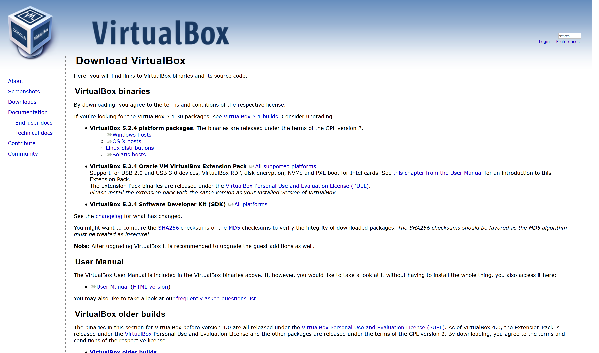
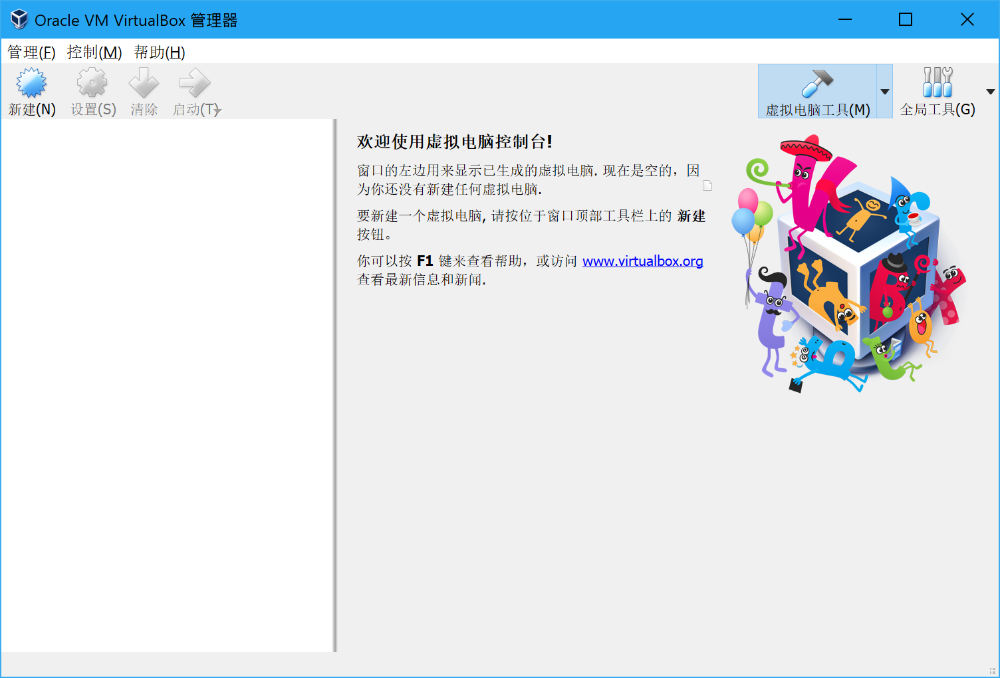

# 下载和安装 VirtualBox

## VirtualBox 是？

> Oracle VirtualBox是由德国InnoTek软件公司出品的虚拟机软件，现在则由甲骨文公司进行开发，是甲骨文公司xVM虚拟化平台技术的一部分。它提供用户在32位或64位的Windows、Solaris及Linux 操作系统上虚拟其它x86的操作系统。用户可以在VirtualBox上安装并且运行Solaris、Windows、DOS、Linux、OS/2 Warp、OpenBSD及FreeBSD等系统作为客户端操作系统。
>
> [https://zh.wikipedia.org/wiki/VirtualBox](https://zh.wikipedia.org/wiki/VirtualBox)

## 下载 VirtualBox

首先用汝喜欢的浏览器打开 [https://www.virtualbox.org](https://www.virtualbox.org/) 呗~然后戳中间大大的 Download 按钮。

需要下载的有两个：

* **VirtualBox x.y.z platform packages**，这个是软件的安装包。
* **VirtualBox x.y.z Oracle VM VirtualBox Extension Pack**，这个是扩展包，提供 USB2.0/3.0 支持等一系列功能。

安装完成以后双击扩展包安装它，于是主界面大概就是这个样子：大概这样就算安装完了？😂

