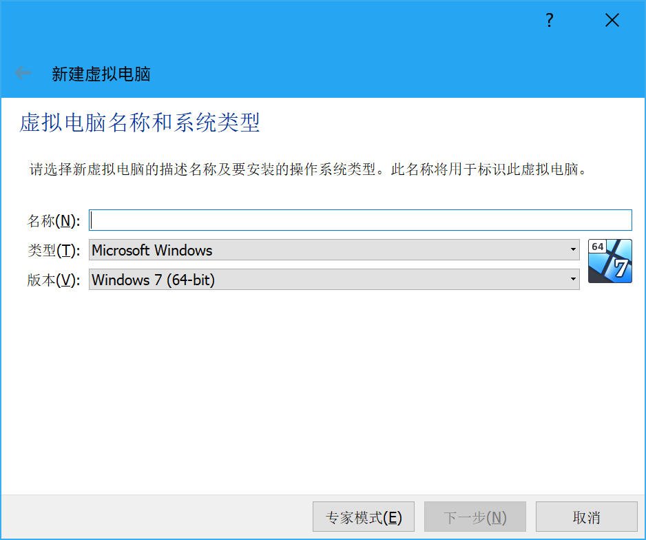
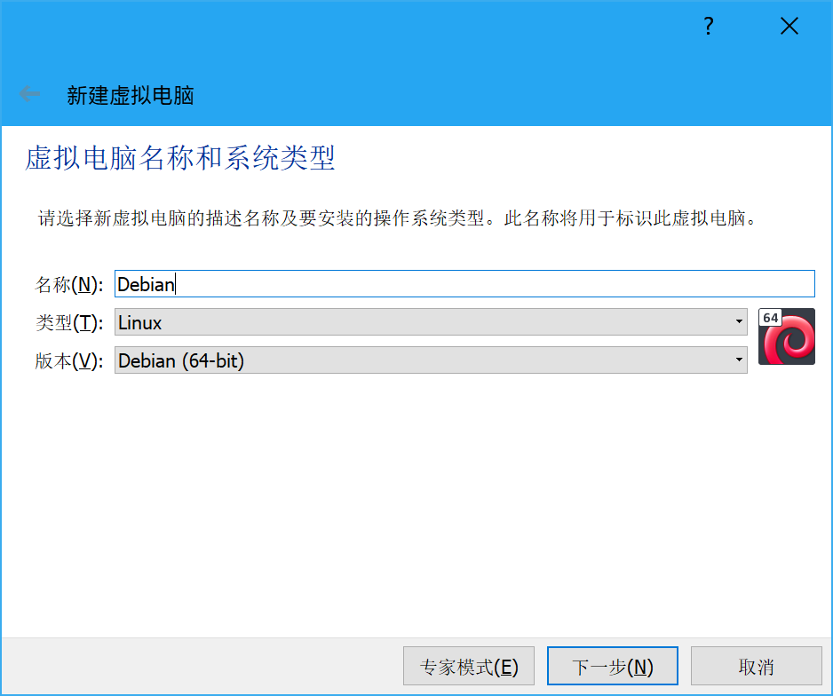
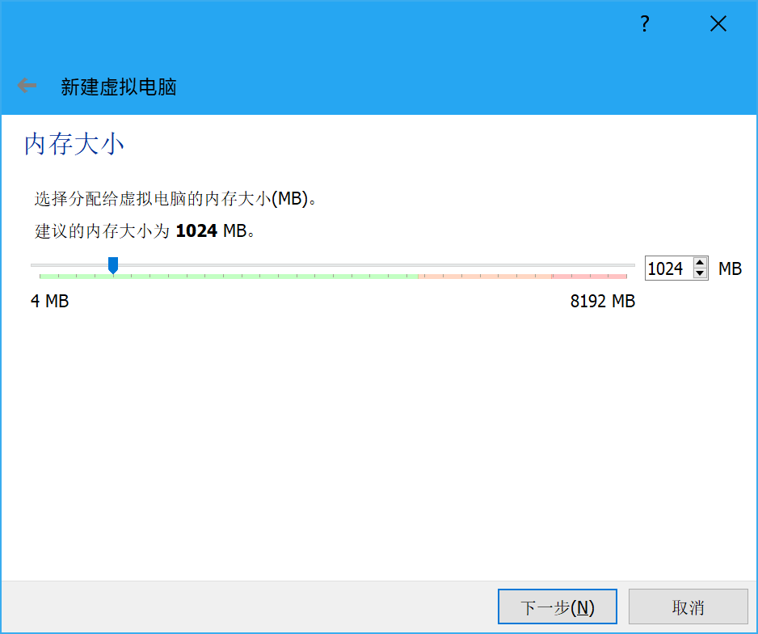
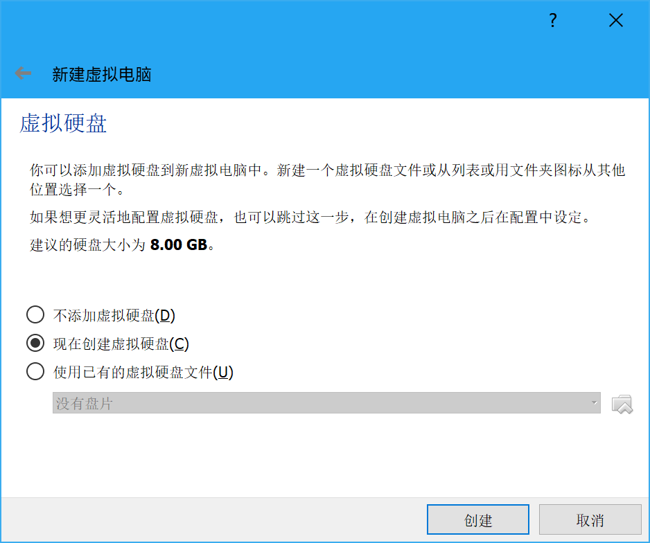
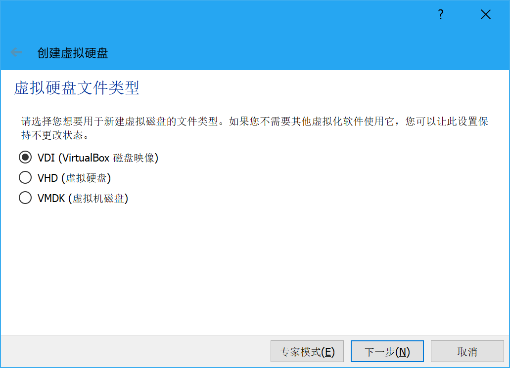
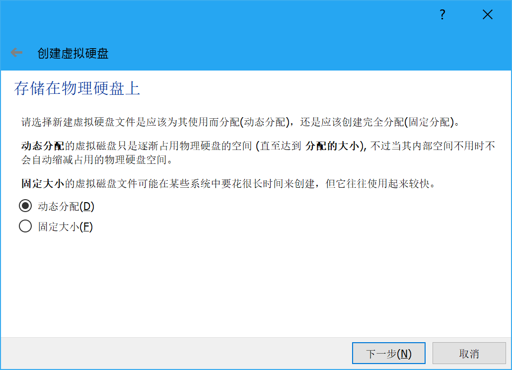
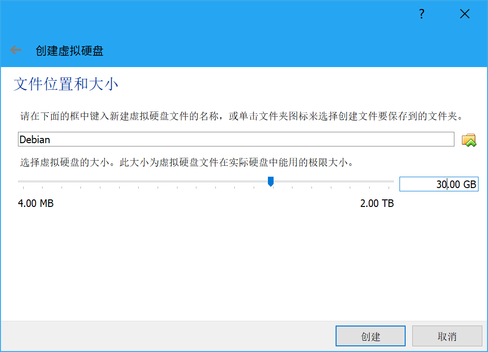
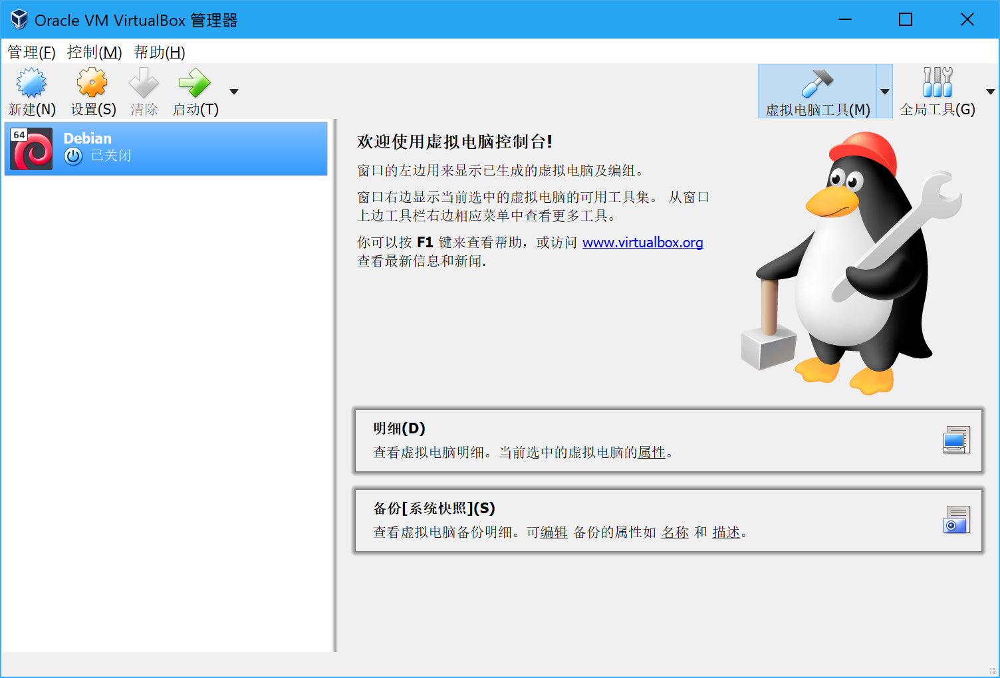
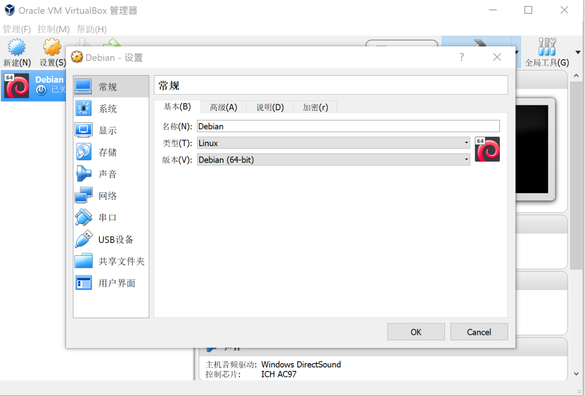

# 创建虚拟机

首先就是戳左上角那个新建：

然后输入虚拟机的名称（咱比较习惯用虚拟系统的名称，于是……）：

分配一定量的内存（太少虚拟机跑不起来，太大会拖慢主机，自己斟酌吧 😂 ：

然后创建一块虚拟硬盘：

就默认的 VDI 好了 😂

选择一种类型，字如屏幕的解释，动态分配创建快，固定大小用起来快 😂

（虽然声称建议 8G 但还是越大越好（前提是没大过物理分区的剩余空间）😂）

然后虚拟机就创建好啦：

如果需要（而且汝知道怎么做）的话可以去设置再调整一下：

