# GNOME æ¡Œé¢ç¯å¢ƒæ¦‚览

## æ¡Œé¢å’Œçª—å£

在输入密ç ç„¶åæˆåŠŸç™»å½•ä»¥å，æ±å¤§æ¦‚看到的会是这个样å­ï¼š

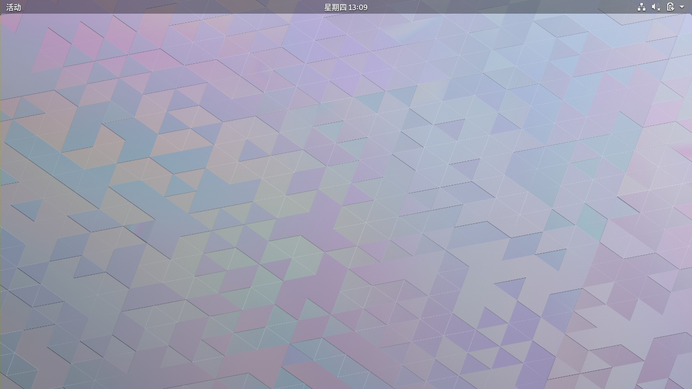

点击å³ä¸Šè§’å¯ä»¥æ‰“开系统èœå•ï¼Œæ±å¯ä»¥åœ¨å…¶ä¸­è°ƒæ•´éŸ³é‡å’Œäº®åº¦ï¼Œå¼€å…³ WiFi å’Œ è“牙（å‰æ是æ±çš„设备å¯ä»¥æ”¯æŒï¼‰ï¼ŒæŸ¥çœ‹ç”µæ± çŠ¶æ€ï¼Œè¿›å…¥è®¾ç½®ï¼Œå…³æœºå’Œé‡å¯ç­‰ç­‰ã€‚

点击中间的区域å¯ä»¥æ‰“开日å†å’Œé€šçŸ¥åˆ—表。

点击左上角（或者直æ¥æŠŠé¼ æ ‡å‘左上方æ¨ï¼‰å¯ä»¥æ‰“开活动视图，就åƒè¿™æ ·ï¼š

活动视图最上方的æœç´¢æ å¯ä»¥æœç´¢åº”用：

或是干些别的（例如计算器😂）

å³ä¾§æ˜¯å·¥ä½œåŒºåˆ—表（就是所谓的虚拟桌é¢å•¦~），把窗å£æ‹–动到新的工作区上就能开å¯ä¸€ä¸ªæ–°çš„工作区。

点击活动视图左侧边æ ï¼ˆå«åšâ€œæ”¶è—夹â€ï¼‰æœ€ä¸‹é¢çš„按钮å¯ä»¥æ‰“开所有程åºåˆ—表：

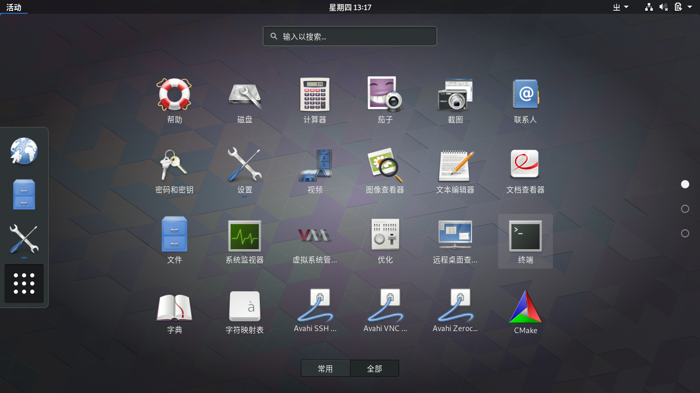

å³é”®ç‚¹å‡»å¯ä»¥çœ‹åˆ°æ·»åŠ åˆ°æ”¶è—夹的选项：

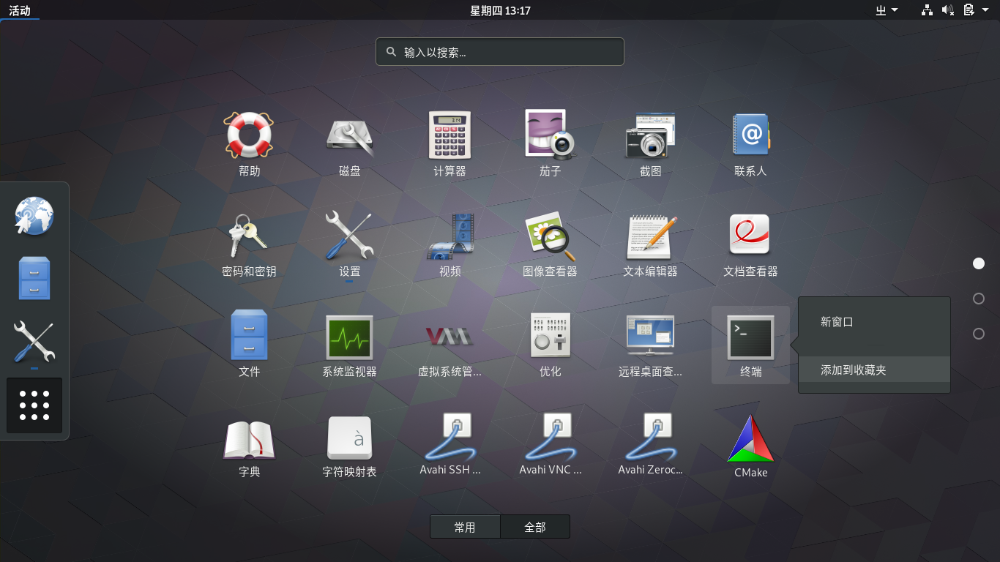

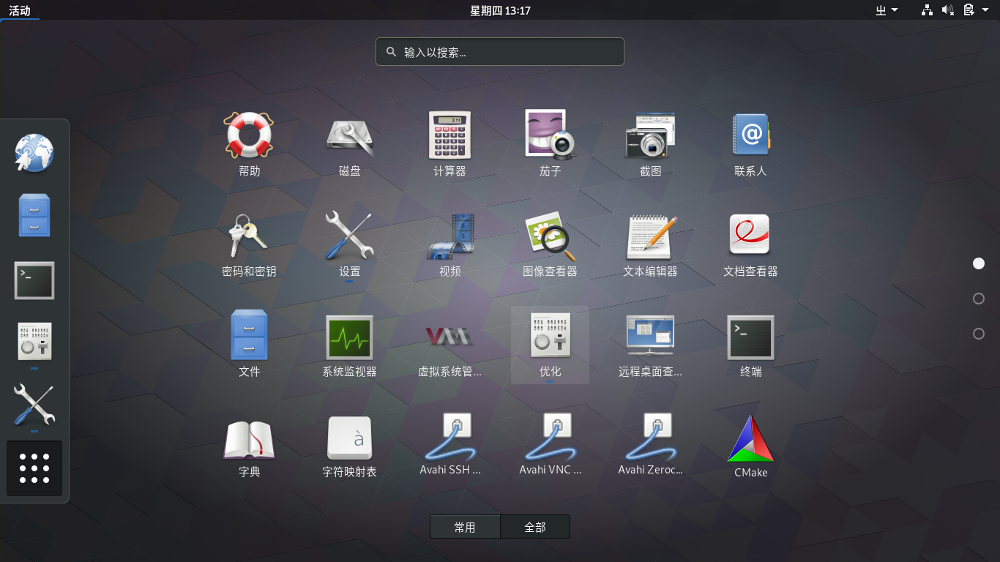

ç°åœ¨å’±ä»¬å…ˆä»ç³»ç»Ÿèœå•æ‰“开设置试试：

大概就是这个样å­â€¦â€¦ WiFi æ—边的开关是å¯ä»¥ç‚¹å‡»æ‹¨åŠ¨çš„，就åƒè¿™æ · 😂：

å¯ä»¥æ³¨æ„到活动æ—边的设置上有个倒三角形，点击å¯ä»¥æ‰“开应用程åºèœå•ï¼š

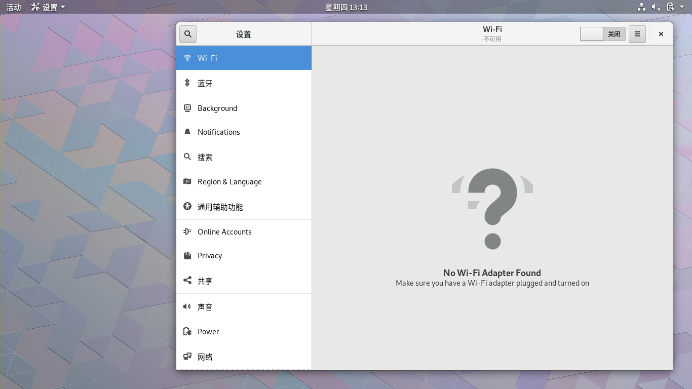

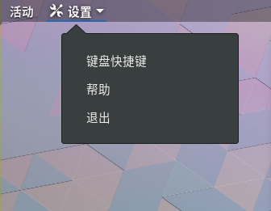

然而大多数程åºåªæœ‰ä¸€ä¸ªé€€å‡ºè€Œå·²â€¦â€¦

点击左上角的æœç´¢æŒ‰é’®å°±ä¼šè¹¦å‡ºä¸€ä¸ªæœç´¢æ¡†ã€‚而且å¯ä»¥ç”¨ 😂

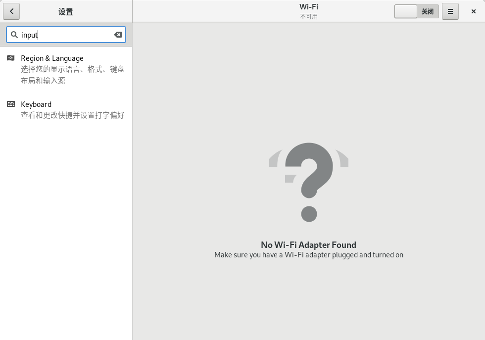

å³ä¸Šè§’的三æ¡æ¨ªçº¿ä¹Ÿæ˜¯ä¸ªèœå•ï¼Œå†…容多åŠå’Œå½“å‰çš„内容相关：

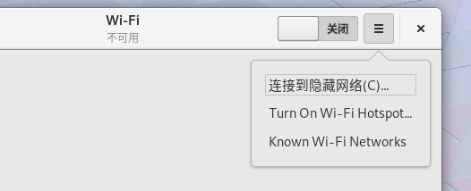

## 文件管ç†å™¨

收è—夹第二个图标就是文件管ç†å™¨å•¦~打开看一看：

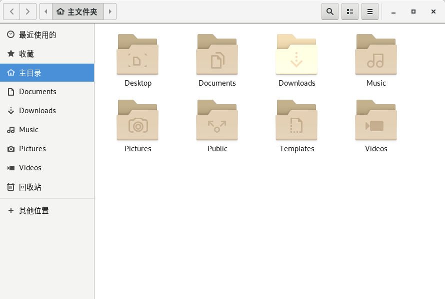

å³ä¸Šè§’的三æ¡æ¨ªçº¿ä¹Ÿæ˜¯ä¸ªèœå•ï¼Œå†…容多åŠå’Œå½“å‰çš„内容相关：

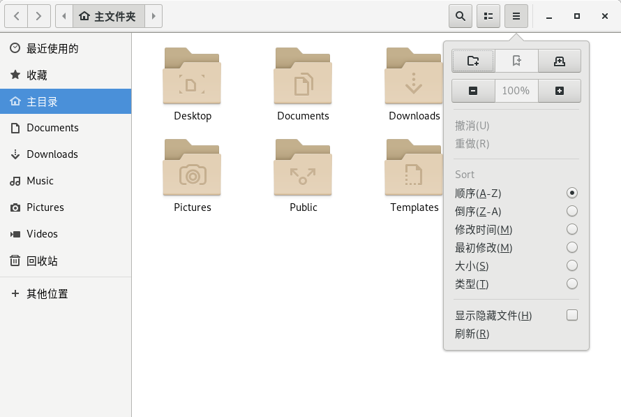

（它左边的按钮ä¾æ¬¡æ˜¯æœç´¢å’Œåˆ‡æ¢åˆ—表/图标视图）

“其它ä½ç½®â€åŒ…å«äº†æ±ç”µè„‘上的其它分区。

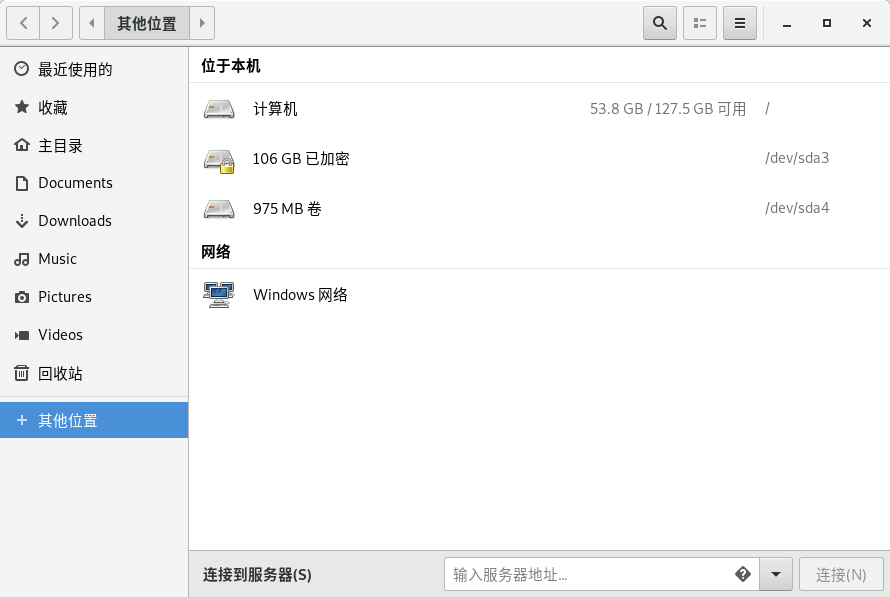

\(å…¶å®å’Œ Windows 的文件资æºç®¡ç†å™¨å¾ˆåƒå§â€¦â€¦\)

## 添加输入æº

> å¯ä»¥çœ‹åˆ°å¤§å¤šæ•°çš„文字还是英文…… 如æœå­¦æœ‰ä½™åŠ›è€Œä¸”英语水平还ä¸é”™çš„è¯ï¼Œä¸å¦¨æ¥å¸®å¿™ç¿»è¯‘下呗~
>
> [https://wiki.gnome.org/TranslationProject](https://wiki.gnome.org/TranslationProject)

å…¶å®å°±æ˜¯è¾“入法啦……

点击 "Region and Language" （区域和语言）打开选å•ï¼š

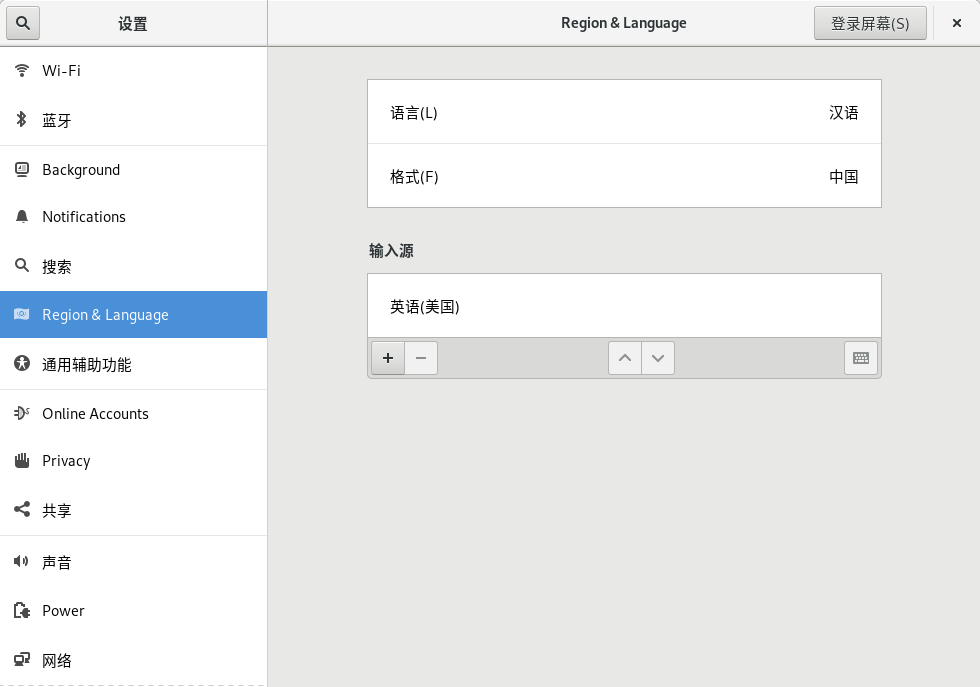

在添加输入æºä¸­ä¾æ¬¡é€‰æ‹© 汉语 - 汉语（Rime）

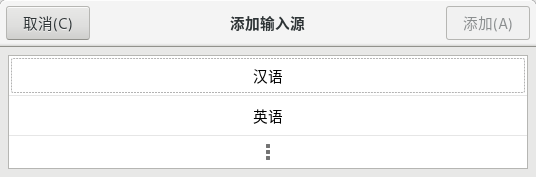

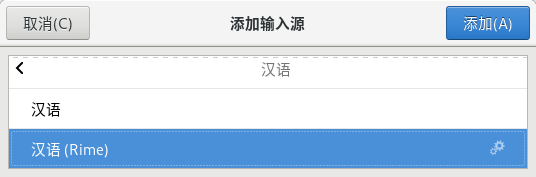

然åå³ä¸Šè§’的系统èœå•ä¸­å°±ä¼šå¤šå‡ºä¸€ä¸ªåˆ‡æ¢è¾“å…¥æºçš„èœå•å•¦~

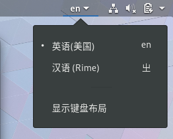

第一次è¿è¡Œ Rime 时会进行部署，等到 “Rime is readyâ€çš„通知出ç°æ—¶â€¦â€¦

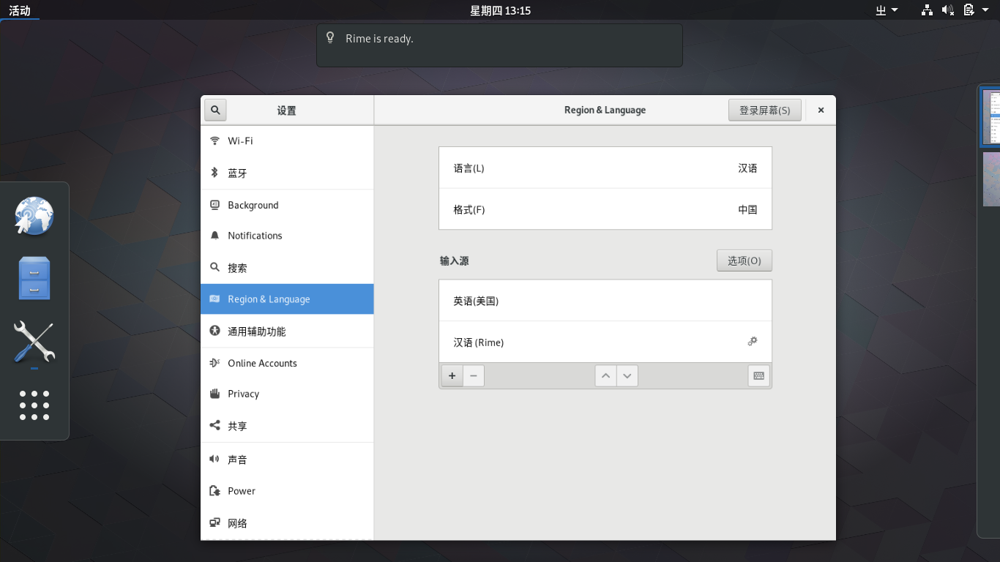

å°±å¯ä»¥ç”¨å•¦ 😂

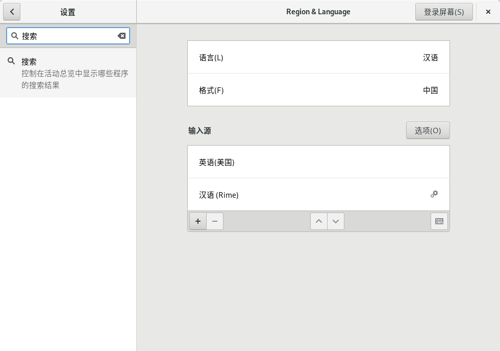

> Rime 默认的输入方案是ç¹ä½“中文的 “朙月拼音â€ï¼Œå¯ä»¥åœ¨è¾“入框上按键盘的 F4 键进入方案选å•åˆ‡æ¢è¾“入方案。

## 优化工具åˆæ¢

有没有å‘ç°çª—å£ä¸Šåªæœ‰ä¸€ä¸ªå…³é—­æŒ‰é’®å•Š 😂，å¯ä»¥ç”¨â€œä¼˜åŒ–工具â€æŠŠå‰©ä¸‹çš„两个按钮找å›æ¥ã€‚

（很好它的åå­—å°±å«â€œä¼˜åŒ–â€ï¼‰â€¦â€¦

打开之å有很多选项，咱们先找到“窗å£â€é‚£ä¸€èŠ‚： 在â€æ ‡é¢˜æ æŒ‰é’®â€œé‚£é‡Œå°±èƒ½æ‰“开（或者关闭）最大化和最å°åŒ–按钮啦~

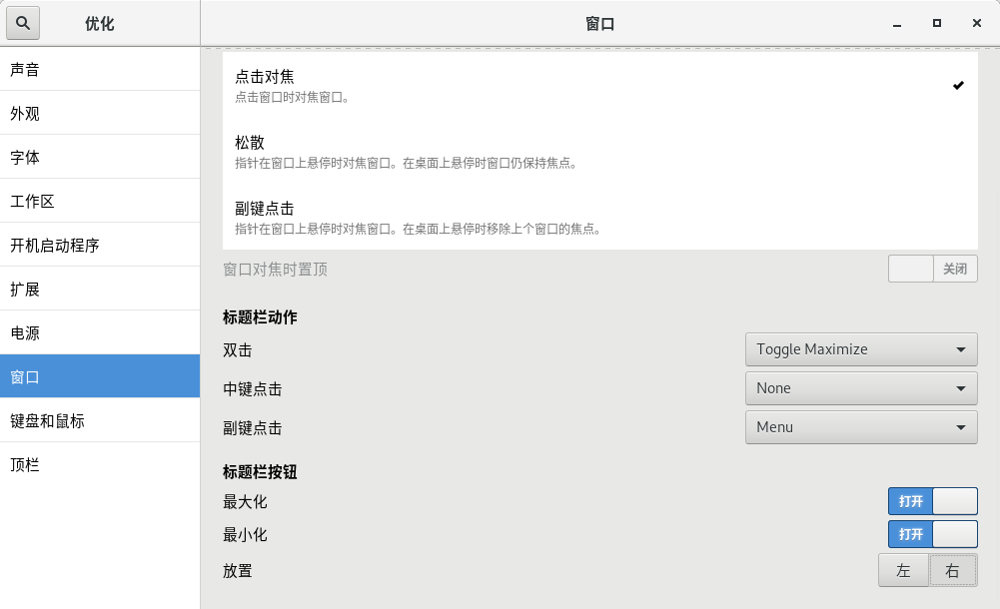

当然è¦æ˜¯æ„¿æ„çš„è¯ä¹Ÿå¯ä»¥æ”¾åœ¨å·¦è¾¹ï¼š

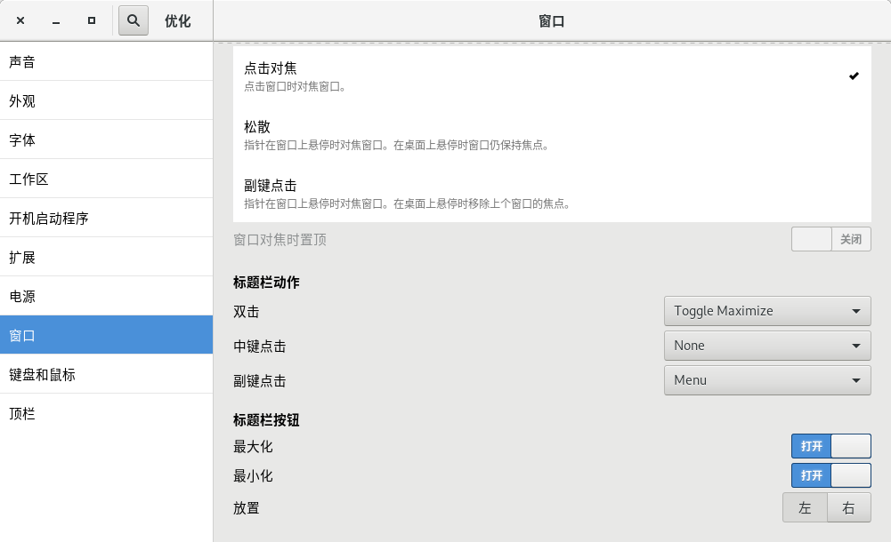

## 终端模拟器和 pacman åˆæ¢

收è—夹第三个图标就是å«ç»ˆç«¯çš„终端模拟器啦~

> 为啥说是终端模拟器呢？ ……

ç°åœ¨æ¥å®‰è£…个æµè§ˆå™¨è¯•è¯•å§â€¦â€¦

äºæ˜¯å°±è£… Iceweasel 了（就是改了商标的 Firefox），用 pacman -Ss å¯ä»¥åœ¨ä»“库中æœç´¢è½¯ä»¶åŒ…。

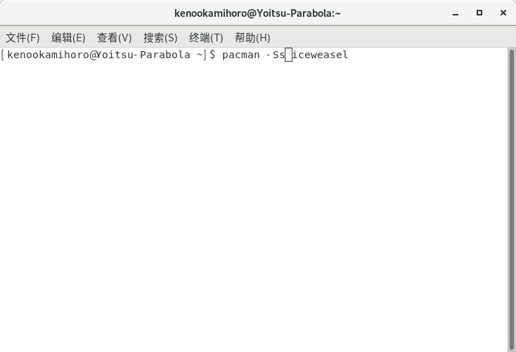

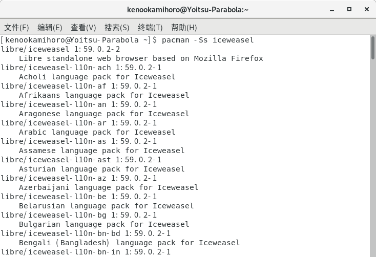

å¯ä»¥çœ‹åˆ°è¿˜æœ‰ä¸€äº› iceweasel-l10n 一类的是 Iceweasel 的语言包啦 ，用 pacman -S å¯ä»¥å®‰è£…指定的软件包，但是……

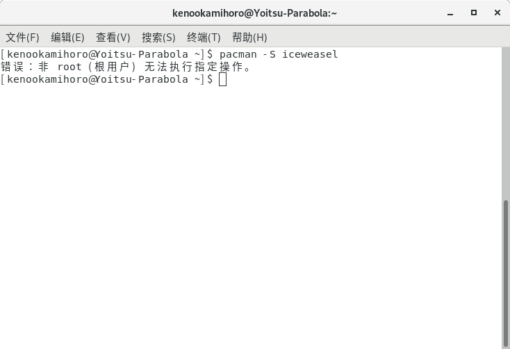

还记得安装时设置的 sudo 嘛 ~

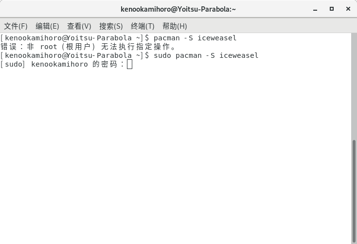

这里输入的是æ±è‡ªå·±çš„密ç ã€‚

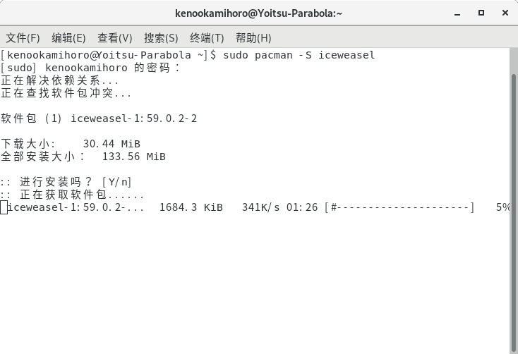

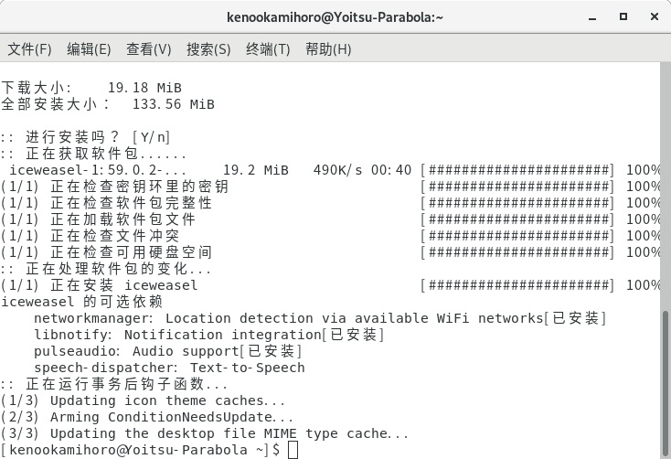

在活动视图的æœç´¢æ¡†ä¸­è¾“å…¥ iceweasel 试试？

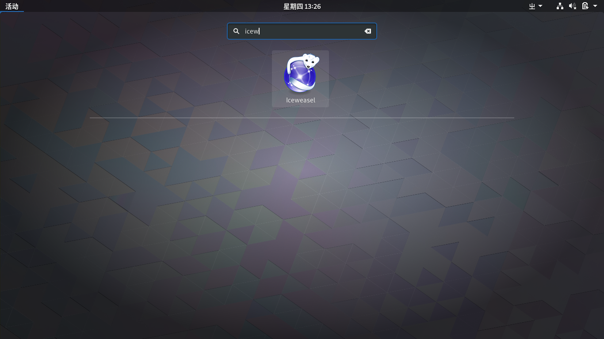

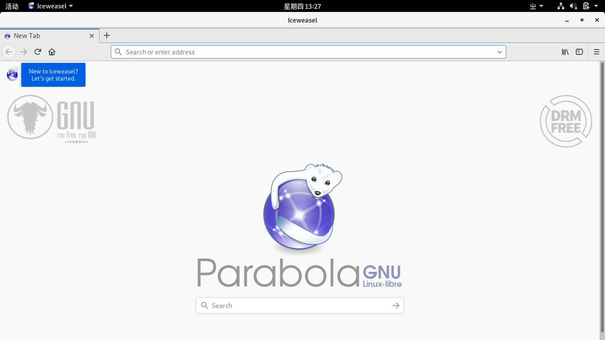

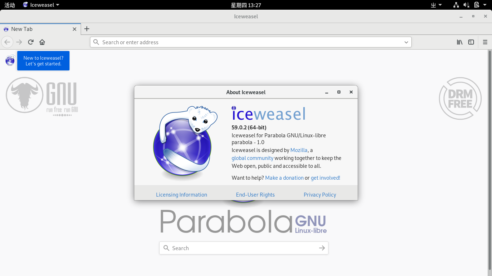

如æœæƒ³åˆ‡æ¢åˆ°ä¸­æ–‡çš„è¯ï¼Œå¯ä»¥å®‰è£… `iceweasel-l10n-zh-cn` 然åé‡æ–°å¯åŠ¨ä¸€ä¸‹ã€‚

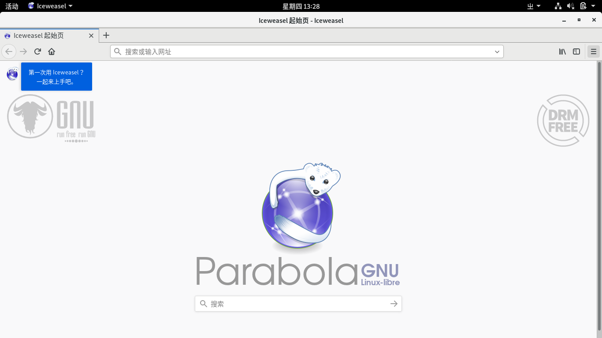

## 还有一件事……

éšç€é€æ¸ä½¿ç”¨ï¼Œç‚¹å‡»åº”用程åºå›¾æ ‡ä¼šé»˜è®¤æ˜¾ç¤ºå¸¸ç”¨åº”用（当然是å¯ä»¥åˆ‡æ¢åˆ°æ‰€æœ‰åº”用å»çš„）

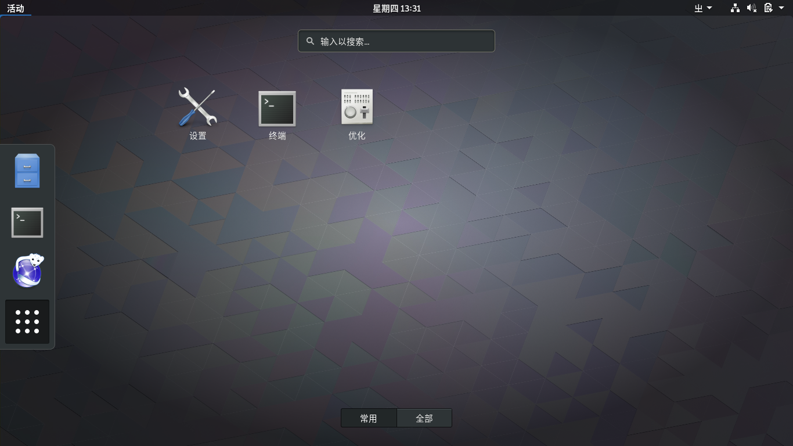

