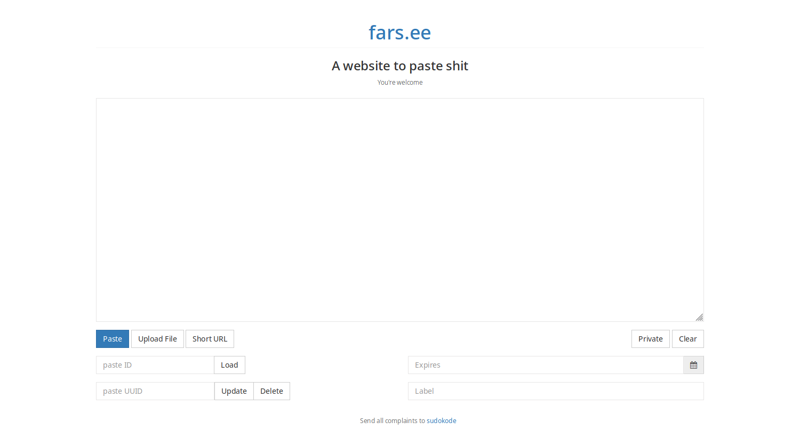
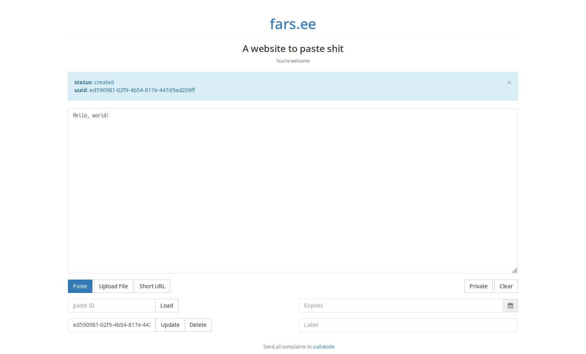
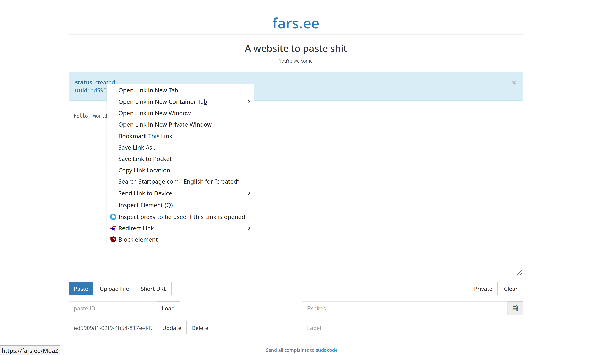

# Pastebin 服务 - 粘贴和分享文字

Pastebin 服务是一种可以存储少量文本的服务，当汝把文字粘贴到 Pastebin 服务上时，汝会获得一个链接。然后汝就可以分享这个链接到需要的地方（例如 IM 上）。

那为啥要这么大费周章呢？

* 防止刷屏， IRC 尤其适用
* 有的 Pastebin 服务支持一些额外功能，例如更新、设置访问密码、设置过期时间和代码格式化等功能。也许能让看的人舒服些……

## 有哪些 Pastebin 服务呢？

* 汝不会上网搜索嘛……
* 以及一些自由软件项目会提供官方的 Pastebin 服务，例如：
  * GNOME Pastebin: [https://paste.gnome.org/](https://paste.gnome.org/)
  * SUSE Paste: [https://paste.opensuse.org/](https://paste.opensuse.org/)
  * Pb: [https://ptpb.pw](https://ptpb.pw)
  * vim-cn: [https://cfp.vim-cn.com/](https://cfp.vim-cn.com/)

## 那该怎么用？

> 下面用 [\#archlinux-cn](https://fars.ee/~readme.html) 的 [farseerfc](https://github.com/farseerfc) 搭建的 ptpb （ [https://fars.ee](https://fars.ee) ）举例。

打开 [https://fars.ee](https://fars.ee) ， 汝就能看到一些基本用法：


核心命令是 `curl -F c=@- "https://fars.ee/"` ，把它和汝需要运行的命令通过管道连接起来。

* 如果确定日志里没有什么敏感信息，又不想费劲存储到临时文件，可以用管道重定向直接让 curl 上传，例如：

```bash
$ journalctl -u privoxy.service | curl -F c=@- http://fars.ee/
date: 2019-03-01T09:06:18.267121+00:00
digest: 76f845c8b79fb65627d4ee2d15178f1f10dfd7e2
long: AHb4Rci3n7ZWJ9TuLRUXjx8Q39fi
short: 39cd
size: 46554
status: created
url: http://fars.ee/39cd
uuid: 11e3d286-77c3-44ab-ba2b-3bbaa11af5d4
```

返回内容中 `url` 那行，就是上传文本的链接啦。把这个链接发送给要分享的人或群组就行。

* 如果需要从临时文件上传日志，可以用类似这样的方式（`your.log`换成你要上传的文件名啦）：

```text
curl -F c=@- http://fars.ee/ < your.log
```

和上面一样，返回内容中 `url` 那行是上传文本的链接。

## 或者汝想用网页上传？

* 打开 [https://fars.ee/f](https://fars.ee/f) , 汝会看到这样的画面：



把汝需要复制的文字贴到中间那个框里，然后按那个蓝色的 Paaste 按钮：



那个 created 实际上是一个链接啦，右键点击那个链接选择复制链接地址或类似的选项把它复制下来：



然后就可以打开它或者发到什么地方去了：


